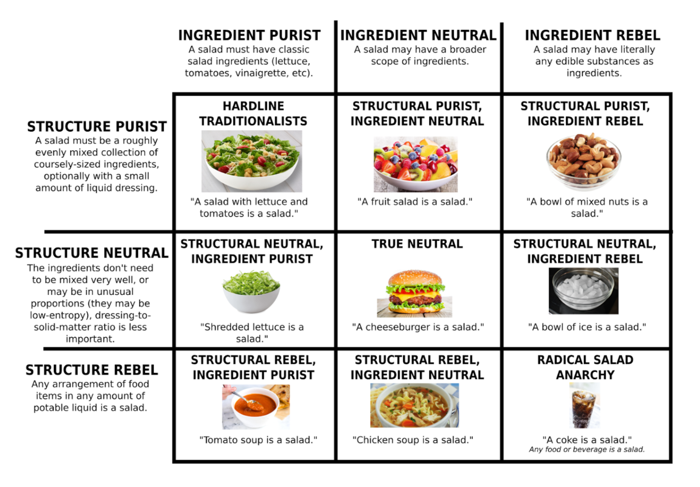

# Salad Theory
A comprehensive, precise, and pedantic branch of set theory pertaining to food categorization.

## Background
In our office, we sometimes enjoy pedantic conversations where we attempt to properly define ambiguous terms. Naturally, when the [sandwich controversy](https://knowyourmeme.com/memes/is-a-hot-dog-a-sandwich) took the world by storm around 2016 <sup>[[3]](#ft3)</sup>, we were interested.

We talked a lot about sandwiches, then went beyond. The sandwich debates spun off numerous side discussions regarding the categorization of other foods. Fatefully, one coworker raised the question of whether a salad could be called a pizza.

The answer to that question shocked and appalled us. Inescapably, a pizza *was actually a salad*.

Many heated lunchtime conversations ensued. We attacked the problem from different angles. We debated the merits of novel definitions. People got sick of it and avoided some of us at lunch.

But the truth could not be avoided. Begrudingly, the office pedants were forced to reach an agreement: All edible foods <sup>[[1]](#ft1)</sup> are salads.

We wrote up our conclusions in an internal document in May 2017. We were content to keep this dark knowledge to ourselves, but alas.
Spurred by the release of food category theories which clearly misrepresent the nature of salads<sup>[[4]](#ft4)</sup>, the time has come to share our
findings with the world.

## Derivation
### Assumptions
1. Any sane definition of a salad **must** at least include foods which a typical English-speaking person would colloquially refer to as a "salad".
2. A typical English-speaking person would consider the following foods "salads": caeser salad, fruit salad, chicken salad, pasta salad, tuna salad, taco salad, and an untossed caeser salad.
3. A good salad definition should be concise. Fewer terms and conditions on the definition of a salad is more elegant (and by Occam's razor, more likely to be correct).

### Considered Definitions and Restrictions
#### Traditional
> A salad must be a mixture of greens.

This definition is simple and restrictive, which is good. Unfortunately, it is too restrictive.

We rejected this definition because it violates assumption (1) by excluding fruit salads, chicken salads, pasta salads, and tuna salads.

#### Well-Mixed
> A salad must be a mixture of foods such that a typical person would
> not notice a difference if the relative position and orientation of
> its ingredients were randomized.

This definition comes close, but it notably excludes an untossed salad, while still including things that are less salad-like than an untossed salad (e.g. a bowl of mixed nuts) which seems preposterous.

Notably, by this definition, most foods (e.g., sandwiches) are still arguably "untossed" salads.

#### Explicit Inclusions
> The set of things that are salads is the set of things listed in assumption (2).

This definition violates assumption 3; merely enumerating a long list of things that *are* salads produces a lazy and cumbersome definition. It also plausibly includes things like a bunch of bananas (fruit salad), so it isn't even very restrictive for all its arbitrary complexity.

#### Explicit Exclusions
> A salad may not contain bread (etc etc).

This condition is not a complete definition unto itself; it is an attempt to restrict the definition to exclude sandwiches and similar foods. This condition has two problems.

First, it fails assumption (1). It plausibly excludes a caeser salad, and possibly pasta salad as well. Croutons are essentially stale bread, and pasta is closely related. Even if you claim that the exclusion is limited to fresh (soft) bread, that leads you to the conclusion that a piece of avocado toast *is* a salad, while a sandwich made with untoasted bread is not, which certainly seems suspect.

Second, it fails assumption (3). The bread exclusion is arbitrary; there's no clear reason to exclude bread but not a variet of other ingredients (e.g. nuts, candy, ice, jams, steaks, lasagna). Including an individual exclusion for each item clearly produces an impracticle, overly-complicated, and probably wrong definition.

#### Solid Content
> A salad must be mostly composed of solid content.

This definition *sounds* reasonable, but it turns out the devil is in the details of how you define "mostly". At what point have you poured in so much balsamic vinaigrette that something stops being a salad?

After much discussion, we ultimately concluded that we have no way of formally distinguishing between a "salad" and a "soup", leading us to Theorem 1.

#### Ingredient Count
> A salad must contain at least two ingredients.

This definition satisfies all of our assumptions. It is also very broad. A coke might not be, but a coke with ice in it is. An individual apple is not a salad, but a pair of apples is a fruit salad. A head of lettuce isn't a salad until you separate the leaves.

This definition is ultimately the only self-consistent definition we could agree upon. Semantically, we refer to all collections of more than one ingredient a "salad", and solitary food items as "low-entropy hyper-salads"/"hypo-salads"/"proto-salads". See Theorem 2.

#### Merriam-Webster 1
[Merriam-Webster](https://www.merriam-webster.com/dictionary/salad)'s first definition of a salad is:
```
Any of various usually cold dishes: such as
  a : raw greens (such as lettuce) often combined with other vegetables
      and toppings and served especially with dressing
  b : small pieces of food (such as pasta, meat, fruit, or vegetables)
      usually mixed with a dressing (such as mayonnaise) or set in gelatin
```

This is actually a pretty strange definition. It includes things like a plate of mixed nuts, but excludes a caesar salad which you stuck in the microwave for two minutes.

While people might object to serving a hot salad, it certainly seems bizarre and objectionable to exclude it from the definition simply based on temperature.

We conclude that this definition does not meet the necessary rigor for a proper salad definition, and additionally it plausibly violates our assumption (3) by addition arbitrary limitations on temperature.

#### Merriam-Webster 2
```
A green vegetable or herb grown for salad
especially : LETTUCE
```

In addition to being self-referential, this definition fails (1) by excluding tuna salad (among others), while still including things like a head of lettuce.

#### Merriam-Webster 3
```
A usually incongruous mixture : HODGEPODGE
```
This is actually broader than our definition: we restrict ours to edible ingredients.

## The Theory
### Theorem 1: Soup-Salad Duality

All foods <sup>[[1]](#ft1)</sup> are formally affine combinations of soups and hyper-salads. We describe this measure as a food’s “soupiness” coefficient, where a food with soupiness=0 contains no exterior liquid, and a food with soupiness=1 contains no solid components.

Colloquially, foods which have soupiness above a certain value tend to be regarded as “soups” (with their liquid components being considered to be “broth”), whereas foods which have soupiness below a certain value tend to be regarded as “salads” (with their liquid components being considered to be “dressing”). With the possible exception of the boundaries (foods which have a soupiness of exactly 0 or 1), Salad Theory does not formally recognize a meaningful distinction between a soupy hyper-salad or a salady soup. That is:

#### Theorem 1.1: Soupiness Lemma
There does not exist a real number `x`, `0 < x < 1` such that all foods with a soupiness less than x are strictly salads, and all foods with a soupiness coefficient greater than x are strictly soups.

#### Theorem 1.2: Beverage Lemma
There is no formal way to distinguish a beverage from a soup with no solid components. Some might claim that substances commonly included in beverages are invalid as foods, but counterexamples to this postulate abound.

Beverage substance | Foods with same substance
------------------ | ------------------------
Water              | Almost everything, especially "soups".
Beer               | Beer batter, many poultry roasts.
Milk               | Many sauces and batters.
Soda               | Coca-Cola BBQ sauce

Furthermore, it is impossible to even exclude beverages which "only" contain a single liquid substance, because doing so would
exclude many colloquial foods (such as tomato soup).


Given that “soups” and “salads” are not meaningfully distinct, we arbitrarily prefer the latter term in most formal discourse.

### Theorem 2: Salads, Hyper-salads, and Saladoids.

A salad requires a certain minimum degree of entropy to be classified as such. Individual solid food items in isolation do not have enough entropy to be full salads, and are instead classified as low-dimensional hyper-salads (i.e. hypo-salads <sup>[[2]](#ft2)</sup>), or low-entropy saladoids.

Thus, a single apple is a low-entropy saladoid, but a set of apple slices is a fruit salad (or, more precisely, an apple salad).

### Theorem 3: Allowed Operations
1. Salads are closed under union and addition (the union of a salad and anything else is a salad).
2. Salads are not closed under subtraction (removing elements from a salad will either produce a salad or a low-entropy saladoid).

## Appendix A: Notable Examples
### Sandwiches
All sandwiches are salads; they just haven't been tossed yet. Typically they have a low soupiness coefficient (unless the sandwich is particularly soggy).

Sandwiches have low entropy (because they are “un-tossed” salads), however they have enough entropy that they are considered full salads instead of low-entropy saladoids. This is because they have more than one ingredient.

### Pizza
Pizzas are actually fairly traditional salads, based on ingredients.

Pizza | Traditional Lettuce-based Salad
------| ------------
Crust | Croutons
Tomato Sauce | Tomatoes
Cheese | Cheese
Greens (Peppers, Spinach, etc) | Greens (Lettuce, Spinach, etc)

Both Pizza and traditional lettuce-based salads can have a wide variety of toppings while people still colloquially acknowledge them as members of their respective groups. They're both even often eaten with ranch or blue cheese dressings.

Structurally, some may take issue because Pizza is (for the most part) bound together in a single piece.
This isn't actually a problem: even Merriam-Webster's first definition makes reference to salads with
pieces bound together with gelatin. If binding ingredients together with jello is valid, surely
binding them together with cheese instead is no issue.

### Tacos
A taco is an untossed taco salad.

### Burritos
Salads are closed under addition. Adding a tortilla to what's *obviously* already a salad hardly makes it any less of a salad.

### Chicken soup
Chicken soup is obviously a salad, even by fairly restrictive definitions (such as being able to mix it without noticing a difference). It's essentially a chicken salad with extra dressing.

### A bowl of nuts
A bowl of nuts is clearly a salad. This isn't very radical; people often include almond slivers and pine nuts in their typical lettuce-based salads.

### Coke with ice
A coke with ice is a salad. It has multiple edible ingredients <sup>[[1]](#ft1)</sup>. The coke is the dressing (or equivalently, the broth of the coke soup). See also: Theorem 1.2.

### A bowl of skittles
A bowl of skittles is a dry salad.

### A glass of water
A glass of water without ice is a low-entropy hyper-salad. It is not a full salad because it has only a single ingredient (it doesn't have enough
ingredient entropy).

A glass of water *with* ice is a salad, but only barely.

## Appendix B: Salad Alignment
In the style of the similar chart regarding sandwiches, we produced a salad alignment chart.



This chart is mostly presented for its comedic value. In accordance with our findings, the "radical salad anarchy"
position is clearly the only logical conclusion.

While it may be tempting to align yourself with something as attractive as "structural purist, ingredient neutral",
the sad truth is that there is no formal way to define exactly what is and what isn't included in "broader scope
of ingredients". Likewise, structure is troublesome to define in terms of liquid content, as described in Theorem 1.1.

## Appendix C: Discussion of Alternative Theories
Here we discuss the authors' review of other theories pertaining to food categorization.

### Cube Rule
The [cuberule](http://cuberule.com/) theory is amusing, but tragically inconsistent. It also performs poorly against Occam's razor (it has seven rules for categorizing food into different sections). The choice of a cube as opposed to other geometric shapes appears to be entirely arbitrary. Each category both omits common foods colloquially considered to be members of it, while including many foods that colloquially are not in it.

Cuberule food categories are extremely unstable. While amusing, we find it particularly objectionable that merely slicing or biting into a food changes its nature according to cuberule (a calzone is a calzone, but a calzone with a bite taken out of it is a bread bowl). The same applies to a burrito (calzone when fully folded, bread bowl when bitten into). Notably, a burrito with a significant quantity of carbs mixed in on the interior (e.g. burritos often contain rice) would actually be categorized as toast, which is peculiar.

By category:

0. **Salad** Correctly includes a fruit salad, but would omit a caeser salad because of the croutons. It also includes things like steak.
1. **Toast** correctly includes foods that are called toast. It also includes a bunch of things people don't normally think of as to toast, like pizza and nigiri sushi.
2. **Sandwich** Correctly includes most sandwiches, but not all. It excludes sub sandwiches where the bread is connected on one side (e.g., like a sandwich you'd pick up from subway). It also would include some peculiar foods, like a single layer of lasagna.
3. **Taco** This correctly includes tacos, but questionably includes things like slices of pie.
4. **Sushi** This category includes maki sushi, but excludes nigiri and sashimi. It also includes an unclosed burrito and a taquito.
5. **Soup/Salad w/ Bread Bowl** This section includes breadbowls unless they have any rice etc in them in which case they're toast.
6. **Calzone** This section includes calzones, jelly-filled donuts, and other such baked goods, as long as you don't cut or bite into them.

Our position is that unintuitive *inclusions* are acceptable so long as there are no unintuitive *exclusions*. But when you have both, it's solid evidence that your rule is wrong.

The examples provided by the cuberule website are also inconsistent with the rules defined by the theory itself. This is not a flaw with the intrinsic theory, but is a criticsm against its presentation (and arguably its intuitiveness, if the author cannot even follow it properly).

For example, they present mashed potatoes, fried rice, and poutine as being salads by their definition, when in fact they'd be toast.

They also say you are "free to interpret the nature of rice however you wish", despite describing fried rice as a salad.

Their description of a Vanilla Soy Latte as a "three bean soup" is entirely valid but also completely irrelevant to the rest of their theory. By their theory they should actually have called it a "three bean salad".


### Soup-Salad-Sandwich Space
The [soup-salad-sandwich space](http://sandwichspace.xyz/) theory attempts to plot all foods along three axes: soups, salads, and sandwiches.

I’m 100% supportive of attempts to project food into 3-dimensional space, but it just doesn’t make sense to have salads and sandwiches as linearly independent axes.

## Community
If you'd like to submit another example or a clarification, PRs are welcome.


If you'd like to formally dissent with our theory in any way, please submit a github [issue](https://github.com/saladtheory/saladtheory.github.io/issues).

## Footnotes
<a name="ft1">[1]</a> We consider "food" to describe anything edible. We sought long and hard for a more restrictive interpretation.
Unfortunately, we failed to find a self-consistent definition of food that included everything colloquially considered to be "food" and
 didn't simply encompass all edible materials. Merriam-Webster's [definitions of food](https://www.merriam-webster.com/dictionary/food),
for example, do seem to at least include candy and water (and by extension, ice). 


<a name="ft2">[2]</a> Much in the same way that a line is formally a low-dimensional hyper-plane.


<a name="ft3">[3]</a> According to google search trends.


<a name="ft4">[4]</a> In particular, [cuberule](http://cuberule.com/) (while amusing) grossly misrepresents salads as
   carb-less foods. This is clearly preposterous, as it would exclude caesar salads and pasta salads. The Cube Rule
   theory also is plainly internally inconsistent with the examples it provides. For example, it claims mashed potatoes
   are a salad due to their lack of carbs. Which is the right answer, for the wrong reasons. Mashed potatoes *are*
   a hyper-salad, but not because they don't contain carbs (they have plenty of starch). By Cube Rule, mashed potatoes would
   seem to be "toast". See Appendix C.


<sub>*All opinions are my own and do not necessarily reflect the positions of my employer or any other organizations I am affiliated with.*<sub>
